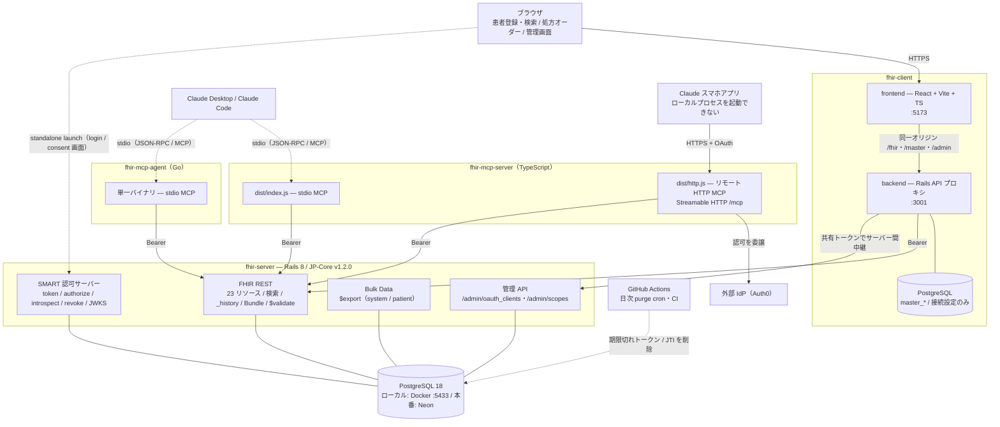
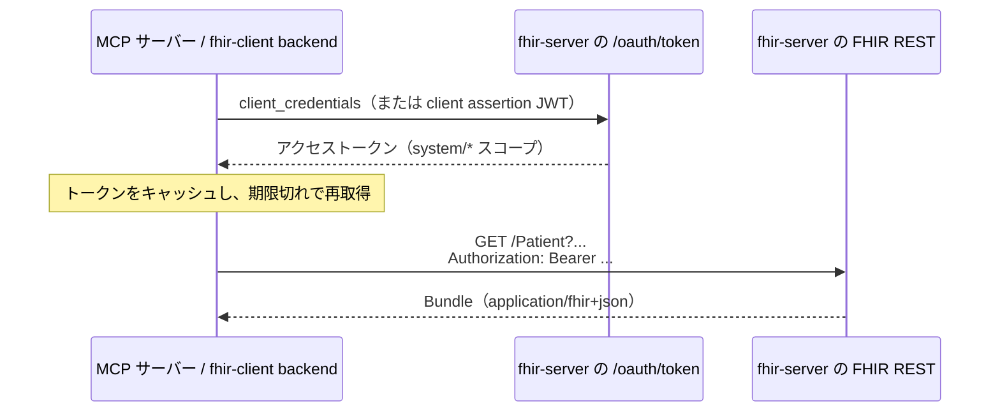
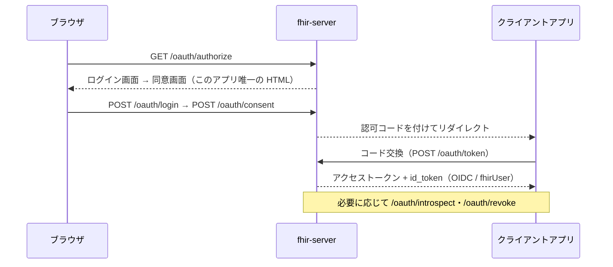

# アーキテクチャ外観（4リポジトリ）

JP-Core 準拠の FHIR R4 サーバーを中心に、Web クライアントと MCP サーバー（TypeScript / Go）が
同じ FHIR REST + SMART Backend Services の接点だけで結びつく構成です。
4 リポジトリの間にコード依存はなく、接点はすべて **HTTP と Bearer トークン**です。

| リポジトリ | 役割 | 主なスタック |
|---|---|---|
| `fhir-server` | FHIR R4 サーバー本体（JP-Core IG v1.2.0 準拠） | Ruby 3.4 / Rails 8（API 専用）/ PostgreSQL 18 |
| `fhir-client` | Web UI ＋ プロキシ backend（処方オーダー基盤） | Rails 7（API 専用）/ Vite + React + TypeScript |
| `fhir-mcp-server` | MCP サーバー（stdio ＋ リモート HTTP） | Node.js 20+ / TypeScript / MCP TypeScript SDK |
| `fhir-mcp-agent` | MCP サーバーの Go 移植（stdio 専用） | Go 1.26+ / 公式 MCP Go SDK |

---

## 全体構成図

利用者・クライアント → 各リポジトリのアプリケーション → FHIR サーバー → 永続化層、の 4 層。
3 つの経路（ブラウザ / ローカル MCP / リモート MCP）はすべて `fhir-server` の FHIR REST に合流します。

凡例: 実線 = HTTP(S) 呼び出し、点線 = stdio または外部スケジュール実行。

---

## リポジトリ別の責務

### `fhir-server` — FHIR R4 サーバー本体

3 リポジトリすべてのアップストリーム。接点は HTTP のみ。

| 領域 | 内容 |
|---|---|
| FHIR REST | 23 リソース（`Patient` / `Observation` / `MedicationRequest` / `DocumentReference` ほか）の CRUD、チェーン検索・`_has`・`_include`、`_history` / vread、条件付き操作、JSON Patch、`$validate`、`Patient/$everything`、Bundle（transaction / batch） |
| 認証・認可 | SMART Backend Services（`client_credentials` / client assertion JWT）、SMART v2 スコープ、OpenID Connect（`id_token` / `fhirUser`）、standalone launch、Token Introspection（RFC 7662）、revoke、JWKS、`.well-known/smart-configuration` |
| Bulk Data | Bulk Data Access IG v2.0.0。`/$export`・`/Patient/$export` と非同期ジョブ、status / download / cancel |
| 運用・管理 | `/metadata`（CapabilityStatement）、`/up`（ヘルスチェック）、`AuditEvent`（サーバー生成・読み取り専用）、管理 API `/admin/oauth_clients`・`/admin/scopes` |

内部構造の要点:

- `app/lib/fhir/` に検索定義・プロファイル検証・スコープ・用語集を集約
- ルーティングは 23 リソースへ同一のルートセットを生成し、`FhirResourcesController` に集約
- 管理 API は FHIR のスコープではなく専用の共有トークン（`FHIR_ADMIN_TOKEN`）で認証し、
  未設定なら常に 503（fail closed）。CORS は意図的に無効

### `fhir-client` — Web UI ＋ プロキシ backend

- **backend（Rails 7 API 専用, `:3001`）**
  - `/fhir/*` を fhir-server へ中継。**FHIR リソースは自 DB に永続化しない**
  - `/master/*` で国内マスタ（HOT コード / 医薬品 / 用法 / 薬効分類）を自 DB 管理（`master_*` テーブル、
    FHIR ではないプレーンな JSON REST）
  - `/admin/*` で接続設定と、上流管理 API へのサーバー間中継
  - 上流接続用の `client_secret` は Active Record Encryption で保管
- **frontend（Vite + React + TypeScript, `:5173`）**
  - 患者の CRUD・検索、処方オーダーの作成／一覧／詳細、マスタ取込、OAuth クライアント管理、接続設定
  - FHIR R4 の JSON を直接組み立て／解釈（`@types/fhir` の `fhir4` 名前空間）

設計上の要点: 上流の管理 API は CORS 無効のため、ブラウザからは必ず backend 経由になります。

### `fhir-mcp-server` — MCP サーバー（TypeScript）

| 入口 | 用途 |
|---|---|
| `dist/index.js`（stdio） | Claude Desktop / Claude Code から起動 |
| `dist/http.js`（Streamable HTTP `/mcp`） | スマホ Claude アプリ向けのリモートカスタムコネクタ。`/.well-known/oauth-*` を自動提供し `/mcp` を Bearer で保護 |

リモート版の OAuth は外部 IdP（Auth0）へ委譲し、**接続の入口を守る役割のみ**。
FHIR への接続は固定の SMART Backend Services クレデンシャルを使います。

### `fhir-mcp-agent` — MCP サーバーの Go 移植

- 公式 MCP Go SDK を使った stdio サーバー。**依存は SDK のみ**（HTTP・JSON・テストは標準ライブラリ）
- `internal/server/tools_*.go` にツール、`internal/fhir/` にクライアントとトークン管理、
  `internal/config/` は環境変数と実行バイナリ同居の `.env` を読む
- `make build-darwin-universal` で Intel / Apple Silicon 両対応の単一バイナリを生成。Docker イメージもあり

### MCP ツール（TS 版 / Go 版で同一）

| ツール | 内容 |
|---|---|
| `get_capabilities` | `/metadata` の CapabilityStatement を要約 |
| `search_fhir` | リソース検索 |
| `read_fhir` | 単一リソースの取得 |
| `patient_everything` | `Patient/$everything` |
| `get_history` | `_history` |
| `validate_fhir` | `$validate` |
| `create_fhir` / `update_fhir` / `patch_fhir` | 書き込み。`FHIR_MCP_ALLOW_WRITES=true` のときのみ登録（既定は無効） |

---

## 認証と主要な経路

### machine-to-machine（MCP / fhir-client backend）

### ユーザー対話（standalone launch）

### 管理操作（OAuth クライアント管理）

1. ブラウザは fhir-client の `/admin` にパスフレーズでログイン（HttpOnly セッション Cookie）
2. fhir-client backend が上流の共有トークンを付けて中継
3. fhir-server の `/admin/oauth_clients` で登録・一覧・削除
4. 共有トークン未設定なら管理 API は常に **503（fail closed）**

---

## デプロイ構成（Render 無料枠 ＋ Neon）

Render の無料 Postgres は 30 日で失効するため、DB は Neon（無料・無期限）を外部利用します。
手順は [DEPLOY_RENDER.md](DEPLOY_RENDER.md) を参照。

| Render サービス | 種別 | 由来リポジトリ | 役割・備考 |
|---|---|---|---|
| `ysnr-fhir-server` | docker / web | `fhir-server` | FHIR API 本体。`WEB_CONCURRENCY=1`（RAM 512MB）、ヘルスチェック `/up` |
| `ysnr-fhir-client-api` | docker / web | `fhir-client`（backend） | FHIR プロキシ + マスタ API。上流へは登録済みクライアント資格情報で接続 |
| `ysnr-fhir-client` | static | `fhir-client`（frontend） | `/fhir`・`/master`・`/admin` を rewrite で backend に寄せて同一オリジン化（CORS 不要）＋ SPA フォールバック |
| `ysnr-fhir-mcp-server` | docker / web | `fhir-mcp-server` | リモート HTTP MCP（`node dist/http.js`）。OAuth は Auth0、ヘルスチェック `/healthz` |
| Neon PostgreSQL | 外部 | 共有（DB は分離） | `fhir-server` と `fhir-client` backend がそれぞれ自分の DB を持つ |
| （常駐なし） | ローカル | `fhir-mcp-agent` | stdio サーバー。MCP クライアントが必要時にバイナリ / `docker compose run` で起動 |

Render 無料枠には cron が無いため、期限切れトークン / JTI の日次 purge は
GitHub Actions（`.github/workflows/purge_expired.yml`）から Neon に直結して実行します。

### ローカル開発時のポート

| サービス | ポート | 備考 |
|---|---|---|
| `fhir-server` web | 3000 | |
| `fhir-server` db | 5433 | ホスト側。Homebrew の PostgreSQL(5432) との衝突回避 |
| `fhir-client` backend | 3001 | |
| `fhir-client` frontend | 5173 | Vite dev proxy が `/fhir`・`/master` を backend へ転送 |
| `fhir-client` db | 5434 | 5433 / 5432 との衝突回避 |

コンテナから fhir-server を参照する場合は `http://host.docker.internal:3000`。
Rails の `HostAuthorization` に阻まれないよう、fhir-client backend は `FHIR_SERVER_HOST_HEADER`
（既定 `localhost:3000`）で上流に許可される `Host` ヘッダーを送出します。
