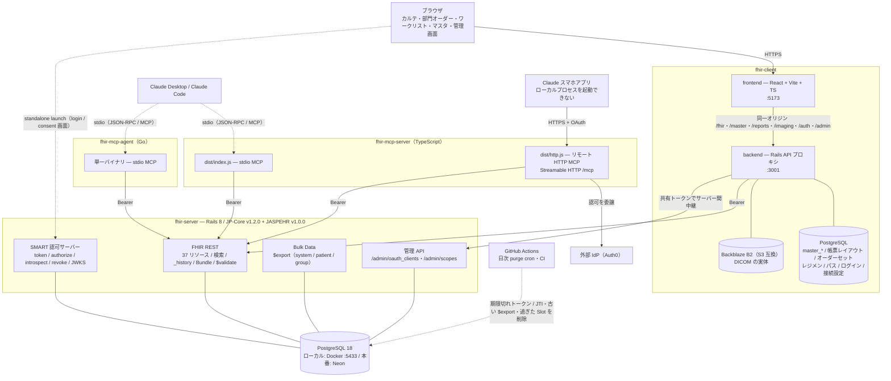
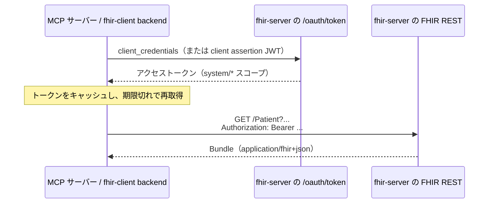
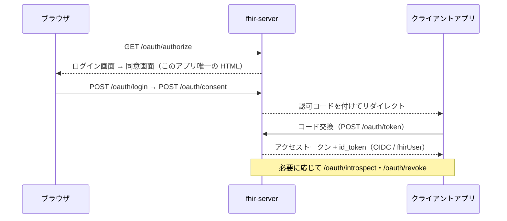

# アーキテクチャ概観（4リポジトリ）

JP-Core（問診票は JASPEHR）準拠の FHIR R4 サーバーを中心に、電子カルテの Web クライアントと
MCP サーバー（TypeScript / Go）が、同じ FHIR REST + SMART Backend Services の接点だけで結びつく構成です。
4 リポジトリの間にコード依存はなく、接点はすべて **HTTP と Bearer トークン**です。

| リポジトリ | 役割 | 主なスタック |
|---|---|---|
| `fhir-server` | FHIR R4 サーバー本体（JP-Core IG v1.2.0 / JASPEHR IG v1.0.0 準拠） | Ruby 3.4 / Rails 8（API 専用）/ PostgreSQL 18 |
| `fhir-client` | 電子カルテ UI ＋ プロキシ backend（診療記録・部門オーダー・マスタ・帳票・DICOM） | Rails 7（API 専用）/ Vite + React + TypeScript |
| `fhir-mcp-server` | MCP サーバー（stdio ＋ リモート HTTP） | Node.js 20+ / TypeScript / MCP TypeScript SDK |
| `fhir-mcp-agent` | MCP サーバーの Go 移植（stdio 専用） | Go 1.26+ / 公式 MCP Go SDK |

診療データの正本は常に `fhir-server` にあります。`fhir-client` が自分の DB に持つのは
**FHIR に置き場の無いもの**（国内マスタ・帳票レイアウト・DICOM の実体・ログイン資格情報など）だけです。

---

## 全体構成図

利用者・クライアント → 各リポジトリのアプリケーション → FHIR サーバー → 永続化層、の 4 層。
3 つの経路（ブラウザ / ローカル MCP / リモート MCP）はすべて `fhir-server` の FHIR REST に合流します。

```mermaid
flowchart TB
    Browser["ブラウザ<br/>カルテ・部門オーダー・ワークリスト・マスタ・管理画面"]
    ClaudeLocal["Claude Desktop / Claude Code"]
    ClaudeMobile["Claude スマホアプリ<br/>ローカルプロセスを起動できない"]

    subgraph clientRepo["fhir-client"]
        FE["frontend — React + Vite + TS<br/>:5173"]
        BE["backend — Rails API プロキシ<br/>:3001"]
        BEDB[("PostgreSQL<br/>master_* / 帳票レイアウト / オーダーセット<br/>レジメン / パス / ログイン / 接続設定")]
        B2[("Backblaze B2（S3 互換）<br/>DICOM の実体")]
    end

    subgraph mcpTs["fhir-mcp-server（TypeScript）"]
        MCPSTDIO["dist/index.js — stdio MCP"]
        MCPHTTP["dist/http.js — リモート HTTP MCP<br/>Streamable HTTP /mcp"]
    end

    subgraph mcpGo["fhir-mcp-agent（Go）"]
        AGENT["単一バイナリ — stdio MCP"]
    end

    IDP["外部 IdP（Auth0）"]

    subgraph serverRepo["fhir-server — Rails 8 / JP-Core v1.2.0 + JASPEHR v1.0.0"]
        REST["FHIR REST<br/>37 リソース / 検索 / _history / Bundle / $validate"]
        AUTH["SMART 認可サーバー<br/>token / authorize / introspect / revoke / JWKS"]
        BULK["Bulk Data<br/>$export（system / patient / group）"]
        ADMINAPI["管理 API<br/>/admin/oauth_clients・/admin/scopes"]
    end

    DB[("PostgreSQL 18<br/>ローカル: Docker :5433 / 本番: Neon")]
    GHA["GitHub Actions<br/>日次 purge cron・CI"]

    Browser -->|HTTPS| FE
    FE -->|"同一オリジン /fhir・/master・/reports・/imaging・/auth・/admin"| BE
    BE --- BEDB
    BE --- B2
    ClaudeLocal -.->|"stdio（JSON-RPC / MCP）"| MCPSTDIO
    ClaudeLocal -.->|"stdio（JSON-RPC / MCP）"| AGENT
    ClaudeMobile -->|"HTTPS + OAuth"| MCPHTTP
    MCPHTTP -->|"認可を委譲"| IDP

    BE -->|"Bearer"| REST
    MCPSTDIO -->|"Bearer"| REST
    AGENT -->|"Bearer"| REST
    MCPHTTP -->|"Bearer"| REST
    BE -->|"共有トークンでサーバー間中継"| ADMINAPI
    Browser -.->|"standalone launch（login / consent 画面）"| AUTH

    REST --- DB
    AUTH --- DB
    BULK --- DB
    ADMINAPI --- DB
    GHA -.->|"期限切れトークン / JTI・古い $export・過ぎた Slot を削除"| DB
```

凡例: 実線 = HTTP(S) 呼び出し、点線 = stdio または外部スケジュール実行。

---

## リポジトリ別の責務

### `fhir-server` — FHIR R4 サーバー本体

3 リポジトリすべてのアップストリーム。接点は HTTP のみ。

| 領域 | 内容 |
|---|---|
| FHIR REST | 37 リソース（`Patient` / `Observation` / `MedicationRequest` / `ServiceRequest` / `Questionnaire` ほか）の CRUD、チェーン検索・`_has`・`_include` / `_revinclude`、`_history` / vread、条件付き操作、JSON Patch、`$validate`、`Patient/$everything`、Bundle（transaction / batch） |
| 独自オペレーション | `$distinct-dates`（ある日付パラメータが取る値の集合。カルテの日付ナビ用）、`$next-identifier`（患者番号などの連番の払い出し） |
| 認証・認可 | SMART Backend Services（`client_credentials` / client assertion JWT）、SMART v2 スコープ、OpenID Connect（`id_token` / `fhirUser`）、standalone launch、リフレッシュトークン、Token Introspection（RFC 7662）、revoke、JWKS、`.well-known/smart-configuration` |
| Bulk Data | Bulk Data Access IG v2.0.0。`/$export`・`/Patient/$export`・`/Group/{id}/$export` と非同期ジョブ、status / download / cancel |
| 運用・管理 | `/metadata`（CapabilityStatement）、`/up`（ヘルスチェック）、`AuditEvent`（サーバー生成・読み取り専用）、rack-attack のレート制限・一時 ban、Sentry（`SENTRY_DSN` 未設定なら無効）、管理 API `/admin/oauth_clients`・`/admin/scopes` |

内部構造の要点:

- **永続化**: リソース型ごとに 1 テーブル。本体は `content`（jsonb）にそのまま入れ、検索に使う値だけを
  列へ展開する。`identifier` / token（`system|code`）/ 履歴は `resource_identifiers`・`resource_tokens`・
  `resource_versions` の共有側テーブルへ正規化する。モデル名＝`resourceType` を不変条件にして、
  polymorphic の `resource_type` 列をそのまま FHIR の型として使う
- **宣言的な定義**: `app/lib/fhir/search_definitions/`（検索パラメータ）と `extraction_definitions/`
  （列・token の抽出）にリソース型ごとの定義を置き、`Fhir::ResourceRegistry` が束ねる。
  検索・索引付けのロジックは共通で、型ごとの差分はこの 2 つの定義ファイルだけ
- **ルーティング**: 37 リソースへ同一のルートセットを生成し、すべて `FhirResourcesController` に集約。
  起動時に自動読込を走らせないよう、型のリストは `routes.rb` に文字列で持ち `ResourceRegistry` と手動で同期する
- **プロファイル検証**: `app/lib/fhir/profile/` が IG のパッケージ（`rails jp_core:*` / `jaspehr:*` で取得）を
  読み、`app/services/*_validator.rb` と組み合わせて `$validate` と書き込み時の検証に使う
- **本番ガードレール**: 認証の無効化・弱い `FHIR_ADMIN_TOKEN`・`FHIR_ALLOWED_HOSTS` 未設定は
  起動時に例外で落とす（静かに開いたサーバーを作らない）
- 管理 API は FHIR のスコープではなく専用の共有トークン（`FHIR_ADMIN_TOKEN`）で認証し、
  未設定なら常に 503（fail closed）。CORS は意図的に無効

### `fhir-client` — 電子カルテ UI ＋ プロキシ backend

`fhir-server` の唯一の対話型クライアントで、外来・入院の診療業務をひと通り扱います。

- **backend（Rails 7 API 専用, `:3001`）**
  - `/fhir/*` を fhir-server へ中継。**FHIR リソースは自 DB に永続化しない**
  - `/master/*` で国内マスタと施設マスタを自 DB 管理（`master_*` 約 90 テーブル。医薬品 / HOT / 用法、
    検体検査 / 放射線 / 生理 / 内視鏡 / 処置 / 手術 / 輸血 / 食事 / 細菌 / 病理の各オーダーマスタ、
    看護実践用語・病名・CTCAE・郵便番号などの配布マスタ、オーダーセット・化学療法レジメン・
    クリニカルパス定義。FHIR ではないプレーンな JSON REST）
  - `/reports/*` で帳票 PDF を生成（問診票、処方箋、注射箋・注射ラベル、検体ラベル）
  - `/imaging/*` で取り込んだ DICOM を保持・配信。**実体は backend 側（Active Storage → Backblaze B2）**、
    上流には `ImagingStudy` だけを置く
  - `/auth/*` がアプリ本体のログイン（医療従事者アカウント。上流 `Practitioner` と 1:1 で、
    資格情報だけをローカルに持つ）、`/admin/*` が接続設定・施設設定・各種の独自カテゴリと、
    上流管理 API へのサーバー間中継
  - 上流接続用の `client_secret` は Active Record Encryption で保管
- **frontend（Vite + React + TypeScript, `:5173`）**
  - カルテ（プロブレム・診療記録・処方・注射・検体検査・放射線・生理・内視鏡・処置・手術・輸血・
    食事・看護・リハビリ・栄養指導・他科依頼などのオーダーと結果、ファイル、DICOM ビューア）、
    各部門のワークリスト、外来 / 入院一覧、病棟マップ、手術カレンダー、予約、
    マスタ管理・帳票レイアウト・OAuth クライアント管理・接続設定
  - FHIR R4 の JSON を直接組み立て／解釈（`@types/fhir` の `fhir4` 名前空間）
  - 通知（緊急異常値・オーダー承認待ちなど）は専用のバックエンドを持たず、FHIR 検索のポーリングで組み立てる

設計上の要点: 上流の管理 API は CORS 無効のため、ブラウザからは必ず backend 経由になります。

### リポジトリ間の取り決め（FHIR 上の契約）

コード依存が無いぶん、**データの形**が実質的なインターフェースです。

- **ローカル拡張の名前空間**: `fhir-client` が定義する拡張・CodeSystem・IdSystem は
  `http://fhir-client.local/...` に統一する（`StructureDefinition/order-department`、
  `CodeSystem/medicine-code`、`IdSystem/lab-label-number` など）。
  サーバーは `content` を素通しで保存するので、これらは検証も索引付けもされずに往復する
- **検索したい拡張だけサーバーに登録する**: 上の原則の例外が `Observation` /
  `QuestionnaireResponse` の `problem` で、プロブレム単位でカルテを縦に読むため、
  ルート直下の拡張を引くローカル検索パラメータをサーバー側に持つ
- **サーバー採番**: 患者番号のような連番はクライアントが `$next-identifier` で払い出す。
  検体ラベル番号（`Specimen.accessionIdentifier`）は例外で、値なしの identifier を付けて
  POST するとサーバーが書き込み時に埋める。対象の system は `SPECIMEN_ACCESSION_SYSTEM`
  （両リポジトリで同じ値）で揃える
- **バイナリ**: 患者に紐づく書類は `Binary` + `DocumentReference` を 1 本の transaction Bundle で
  上流へ保存する。一方 DICOM の実体だけは容量の都合で backend 側（B2）に置き、上流には
  `ImagingStudy` のメタデータのみを置く

### `fhir-mcp-server` — MCP サーバー（TypeScript）

| 入口 | 用途 |
|---|---|
| `dist/index.js`（stdio） | Claude Desktop / Claude Code から起動 |
| `dist/http.js`（Streamable HTTP `/mcp`） | スマホ Claude アプリ向けのリモートカスタムコネクタ。`/.well-known/oauth-*` を自動提供し `/mcp` を Bearer で保護 |

リモート版の OAuth は外部 IdP（Auth0）へ委譲し、**接続の入口を守る役割のみ**。
FHIR への接続は固定の SMART Backend Services クレデンシャルを使います。

### `fhir-mcp-agent` — MCP サーバーの Go 移植

- 公式 MCP Go SDK を使った stdio サーバー。**依存は SDK のみ**（HTTP・JSON・テストは標準ライブラリ）
- `internal/server/tools_*.go` にツール、`internal/fhir/` にクライアントとトークン管理、
  `internal/config/` は環境変数と実行バイナリ同居の `.env` を読む
- `make build-darwin-universal` で Intel / Apple Silicon 両対応の単一バイナリを生成。Docker イメージもあり
- 移植から先に進んでおり、TS 版に無い業務寄りのツール（処方・検査結果・transaction）を持つ

### MCP ツール

| ツール | 内容 | TS | Go |
|---|---|:-:|:-:|
| `get_capabilities` | `/metadata` の CapabilityStatement を要約 | ✓ | ✓ |
| `search_fhir` | リソース検索 | ✓ | ✓ |
| `read_fhir` | 単一リソースの取得 | ✓ | ✓ |
| `patient_everything` | `Patient/$everything` | ✓ | ✓ |
| `get_history` | `_history` | ✓ | ✓ |
| `validate_fhir` | `$validate` | ✓ | ✓ |
| `create_fhir` / `update_fhir` / `patch_fhir` | 汎用の書き込み | ✓ | ✓ |
| `post_transaction` | transaction Bundle の投入 | — | ✓ |
| `create_prescription` | 処方（`MedicationRequest`）をまとめて作成 | — | ✓ |
| `create_lab_result` | 検査結果（`Observation` ほか）をまとめて作成 | — | ✓ |

書き込み系は両実装とも `FHIR_MCP_ALLOW_WRITES=true` のときだけ登録します（既定は無効）。

---

## 認証と主要な経路

### machine-to-machine（MCP / fhir-client backend）

```mermaid
sequenceDiagram
    participant C as MCP サーバー / fhir-client backend
    participant A as fhir-server の /oauth/token
    participant F as fhir-server の FHIR REST

    C->>A: client_credentials（または client assertion JWT）
    A-->>C: アクセストークン（system/* スコープ）
    Note over C: トークンをキャッシュし、期限切れで再取得
    C->>F: GET /Patient?... <br/>Authorization: Bearer ...
    F-->>C: Bundle（application/fhir+json）
```

### ユーザー対話（standalone launch）

```mermaid
sequenceDiagram
    participant U as ブラウザ
    participant S as fhir-server
    participant App as クライアントアプリ

    U->>S: GET /oauth/authorize
    S-->>U: ログイン画面 → 同意画面（このアプリ唯一の HTML）
    U->>S: POST /oauth/login → POST /oauth/consent
    S-->>App: 認可コードを付けてリダイレクト
    App->>S: コード交換（POST /oauth/token）
    S-->>App: アクセストークン + id_token（OIDC / fhirUser）
    Note over App,S: 必要に応じて /oauth/introspect・/oauth/revoke
```

### 2 段構えのログイン（fhir-client）

ブラウザの利用者と、上流に対するクライアント資格情報は別物です。

1. **医療従事者**は fhir-client の `/auth/session` に ID / パスワードでログインする
   （`users` テーブル。上流 `Practitioner` と 1:1、HttpOnly セッション Cookie）
2. **管理者**は `/admin/session` に `ADMIN_TOKEN` をパスフレーズとしてログインする
   （固定ユーザー `administrator`。DB に置かない）
3. 上流への接続は利用者に関係なく、backend が持つ 1 組の SMART Backend Services
   クレデンシャルで行う。上流から見た主体は常に「fhir-client」

### 管理操作（OAuth クライアント管理）

1. ブラウザは fhir-client の `/admin` にパスフレーズでログイン（HttpOnly セッション Cookie）
2. fhir-client backend が上流の共有トークンを付けて中継
3. fhir-server の `/admin/oauth_clients` で登録・一覧・削除
4. 共有トークン未設定なら管理 API は常に **503（fail closed）**

---

## デプロイ構成（Render 無料枠 ＋ Neon）

Render の無料 Postgres は 30 日で失効するため、DB は Neon（無料・無期限）を外部利用します。
手順は [DEPLOY_RENDER.md](DEPLOY_RENDER.md) を参照。

| Render サービス | 種別 | 由来リポジトリ | 役割・備考 |
|---|---|---|---|
| `ysnr-fhir-server` | docker / web | `fhir-server` | FHIR API 本体。`WEB_CONCURRENCY=1`（RAM 512MB）、ヘルスチェック `/up` |
| `ysnr-fhir-client-api` | docker / web | `fhir-client`（backend） | FHIR プロキシ + マスタ / 帳票 / DICOM API。上流へは登録済みクライアント資格情報で接続 |
| `ysnr-fhir-client` | static | `fhir-client`（frontend） | `/fhir`・`/master`・`/reports`・`/imaging`・`/auth`・`/admin` などを rewrite で backend に寄せて同一オリジン化（CORS 不要）＋ SPA フォールバック |
| `ysnr-fhir-mcp-server` | docker / web | `fhir-mcp-server` | リモート HTTP MCP（`node dist/http.js`）。OAuth は Auth0、ヘルスチェック `/healthz` |
| Neon PostgreSQL | 外部 | 共有（DB は分離） | `fhir-server` と `fhir-client` backend がそれぞれ自分の DB を持つ |
| Backblaze B2 | 外部 | `fhir-client`（backend） | DICOM の実体。Render 無料枠に永続ディスクが無いため外部の S3 互換ストレージを使う |
| （常駐なし） | ローカル | `fhir-mcp-agent` | stdio サーバー。MCP クライアントが必要時にバイナリ / `docker compose run` で起動 |

Render 無料枠には cron が無いため、日次のメンテナンスは GitHub Actions
（`.github/workflows/purge_expired.yml`、JST 04:00）から Neon に直結して実行します。

| rake タスク | 消すもの | 保持期間の既定 |
|---|---|---|
| `fhir:purge_expired` | 期限切れのアクセス / リフレッシュトークン、client assertion の JTI | 30 日（`FHIR_TOKEN_RETENTION_DAYS`） |
| `fhir:purge_bulk_exports` | 終了した `$export` と、ハートビートの切れた実行中ジョブ | 3 日（`BULK_EXPORT_RETENTION_DAYS`） |
| `fhir:purge_past_slots` | 過ぎた予約枠（予約が押さえている枠は残す） | 30 日（`SLOT_RETENTION_DAYS`） |

### ローカル開発時のポート

| サービス | ポート | 備考 |
|---|---|---|
| `fhir-server` web | 3000 | |
| `fhir-server` db | 5433 | ホスト側。Homebrew の PostgreSQL(5432) との衝突回避 |
| `fhir-client` backend | 3001 | |
| `fhir-client` frontend | 5173 | Vite dev proxy が `/fhir`・`/master` ほかを backend へ転送 |
| `fhir-client` db | 5434 | 5433 / 5432 との衝突回避 |

コンテナから fhir-server を参照する場合は `http://host.docker.internal:3000`。
Rails の `HostAuthorization` に阻まれないよう、fhir-client backend は `FHIR_SERVER_HOST_HEADER`
（既定 `localhost:3000`）で上流に許可される `Host` ヘッダーを送出します。
